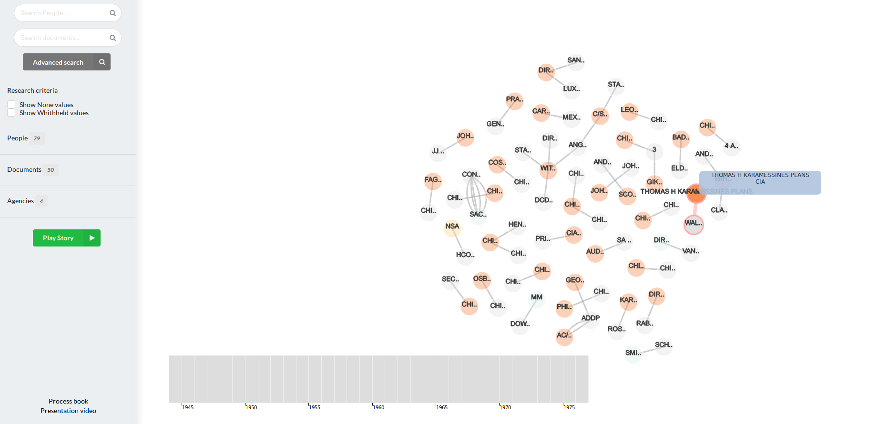
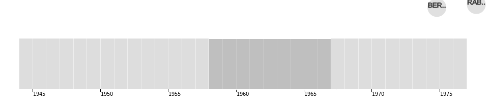
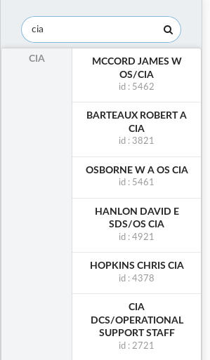
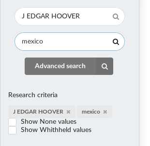
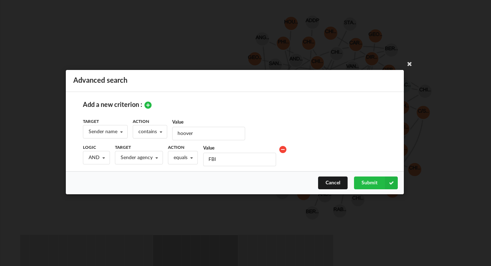
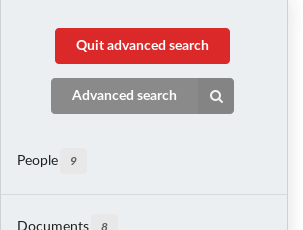
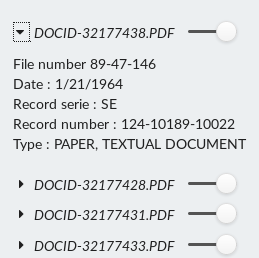
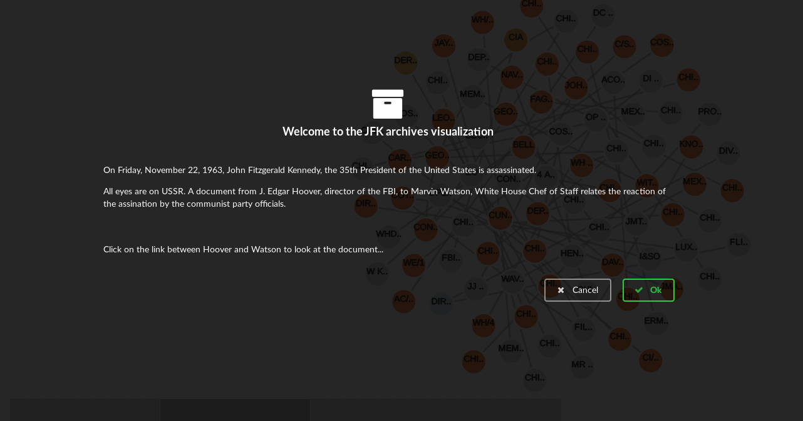

# JFK Data visualization

## Overview

The application is composed of an oriented graph, where each node represents a person. The color of each node is related to the organization to which it belongs. The link between each person represents the document they have exchanged. The user can click on these links to see the content of the related document.

Additional panels allow filtering the results :

- By creation date : Chronological time line with selectable interval
- By governmental organisation (FBI, CIA...)
- By people (sender or recipient)
- By document, using document id or keyword
- By any property, using advanced search

## Target audience

Our project targets people willing to analyze data that were published by US national archives, as it is quite complicated to browse through documents. Indeed, nothing is implemented to ease this browsing through the thousands of documents. Thus, our project aims to help, journalists, scientists, historians, to find and extract useful information from raw data.

## Motivation

The project idea comes from our curiosity for these newly publicly published documents. When we wanted to explore them, we were quickly discouraged by the difficulty of visualization. Moreover, the fact that the data was published recently, is an additional motivation, as not similar work was already done.

## Related work

As the data is relatively new, we did not find any related work. Between the beginning and the end of our project, we have found that someone launched OCR to all the released documents in order to index their content ([https://github.com/danveloper/jfk-files](github link)). Related work also includes newspaper articles that talk about the release but without any visualization ([https://www.nytimes.com/2017/11/09/us/politics/latest-batch-of-jfk-assassination-records-released.html](new York times article))

## What are we trying to show ?

Through our visualization, we want to show the relations between people or between agencies and their evolution through time. We also want to show stories that are formed by documents. Finally, we aim to show the diversity of actors and document that intervened during all the XXe century, trying to solve this assassination case.

## Dataset

We obtained our dataset in the [US national archive website]("https://www.archives.gov/research/jfk/2017-release"). The dataset was presented as a csv file, containing in each row the data related to one document. The total size of our dataset consist in 33,386 documents sent between 6300 people in 79 agencies (this is not an exact count for people and agencies but it the number of instances in our database). As we wanted to use it, we noticed many inconsistencies, for example with the people names were many typing errors occurred. As our current project is more oriented around visualization, we did not have the time to run a full data analysis to correct all those errors, thus, it remains many of those errors in our final work, errors that we could correct with more time. But we did a small correction step on the names, as we think it is important to associate all the documents to the same node :

- We set everything in lower case to avoid case errors
- We removed some stop words, punctuation and brackets groups
- We tried to associate some typing errors and acronyms to the same entities.
- We removed more than 500 duplicates with these small steps

We also set all missing values to 'None' Then we had to import this dataset into the Neo4j database because of its size. Neo4j is a graph database, in which we represented people as nodes, documents as relation between these nodes and agencies as nodes properties. In our dataset we had two columns that mentions agencies, namely `Agency` and `Originator`, and it is not very clear which column is related to which person (sender, recipient). In a first version, we associated Agency to the recipient and `Originator` to the sender, but we had many inconsistencies with this behavior (for example `director FBI` was associated to the CIA). We decided to not keep the `Originator` column in our data to avoid these errors, but it was at the cost of many undefined agencies, we considered it was more important to have fewer data but more correct one. The (nearly) initial dataset is available as `data.csv` and the modified one as `data_treated.csv`

## Exploratory data analysis

Because of the size of our dataset, we had to use special techniques in order to have a global idea of the content. First we used the filter functions of our spreadsheet software to see the number of records, date boundaries, number of undefined values and so on. After importing the dataset on our database we used a bit the integrated visualization to try to see some patterns (but as it is not really well implemented it often crashes). We used our own basic visualization, a simple d3js force layout with light effects and events in order to see a lot of data at once. Finally, we used targeted requests through the database (neo4j can be requested with a specific language, as classical databases can be), in order to find specific documents or to count number of documents in a period.

## Evolution of design

### Overview and main difficulties

When we have chosen our project we did not expect all the difficulties we encountered. Especially we thought that we could use a dedicated library in order to implement the basis of our network. However, because of the multi edges property of our project, we did not manage to find such a library and therefore we re implemented most of the work from scratch. This leads us to a larger workload than expected and to many implementation problems (implementing the zoom, the edges while everything remains readable and user friendly...). We really had big troubles with zoom, drag and drop to translate the network and with the division of nodes in the window to have a readable graph. For example, we computed sub graphs but did not manage to have good enough customized force in time (see remaining work part). We found that there are not so many examples for our problem, considering that in addition many examples are not using the last version of d3.

### First approach

In a first approach we implemented a basic network and a brush timeline, without zoom behavior and with raw css. We did not implement any search bar or agency selection. We used d3 js version 4. We decided to start with the implementation of multi-edges as is we considered it as the most difficult part. We added events for edge click, node and links hover to highlight connection between nodes.

### Zooming and brushing

In order to add interactivity to our project we decided to add a timeline with brushing, we implemented two versions, one with a zoom property and one more classical. The one with zoom version appeared to have too many bugs and its behavior was not consistent in chrome and firefox, thus we decided to remove it in our last project. We also implemented the zoom, that we use (with some modification) in our final project. However, we used a central force for our layout in order to be centered even after updating the size of the window, force that we removed.

### Moving to semantic ui

As we wanted to add new features that required additional elements, it became obvious that we should use a css framework instead of keeping implementing everything by hand. We added a sidebar and a tabular menu, we restricted our graph to a single container. Both the tabular menu and the restricted container were removed because it was either inefficient or not adapted to our need.

### Filters details and search bar

As the network and the brushing part started to have most of the required properties, we implemented the search bar that we considered during our first plans. We thought it was a good idea to add an auto completion feature for people, as the user might not be familiar with all the implicated people (moreover, because of the bad quality data, it may remains typing errors which could prevent the user to find the wanted target). Because of all the information available for the documents, we decided to put a sidebar with all the information for each people, each document and each agency. In the same process we added the possibility to hide and show agencies, people,and documents.

### Improved style

As we had more and more features, we realized that we used an ugly interface and that the overall result was not acceptable. We restyled everything in our interface, starting by the sidebar.

### Advanced search, node colors and research criteria

We decided to add the possibility for the user to make an advanced search, so that he can freely explore all the data we have collected (because with the feature implemented at this time it was limited to people and basic document properties). This was not a planned feature but it seems to be useful for finding specific document.

As we planned we also change the default node color to add a color relative to the node agency. We also reduced the link distance in order to reduce the mish mash between all nodes. As it was not very clear which criteria should be used when we change a parameter (for example when change the time through the timeline, should we keep the people criteria ?), we decided to put in the sidebar the actual used criteria with the possibility to erase them if needed.

### Play history

A major feature was missing in our visualization : tell story with our data. Thus, we implemented 3 short stories as example of what we can do with our project.

## Implementation

- The main graph is draggable (click on the page), zoomable(wheel or pad) and responsive (rescale and recenter when the size change)
- Each node is draggable and will remain at the place after the drag ends. On hover the node is highlighted, and all connected links and nodes aswell. The full name of the node is shown on hover and a small tool tip show the name and the agency.
- Each link is clickable and will open the real document and a new tab. On hover, a link is highlighted and a tool tip show all informations relative it.
- The time line behave as a brush, the user can select a zone and drag it to the correct place, the brush will adapt the actual input to match the specific time selected (limited to the year precision) 
- The people search bar proposes auto completion (starting at 2 characters), the results are limited to 10 people and are sorted by agency. On click on a specific result, the graph will be updated with all the links linked to the selected people. 
- The document search bar automatically update the graph result with any document that contains the current input in one of its properties (such as name, title, comments.). This criterion is added to an eventual people criterion. 
- Advanced search : On click it opens a modal where the user can select up to 8 criteria to match

  - The user can click on the green "+" button to add a criterion
  - The user can click on the "-" red button in each additional line to remove the current line
  - When the user chose a target field, the action dropdown is updated to propose choices that matches the input, and a final input is added accordingly (text or date picker).
  - On cancel user goes back to the previous state.
  - On submit the user enter the advanced search mode : a quit button appears at the top of the sidebar, search bars, search criteria and time line are hidden.
  - On Quit advanced search click, the user retrieves the same state as before.  

- When clicking on a label situated in the research criteria area, the criterion is deleted and the graph is refreshed. If there is no criterion left, the graph is set to the default criteria.

- When selecting one of the checkboxes, none values (or withheld) are accepted as a result and the graph is updated.
- When clicking on people/Documents or agencies the accordion is activated and show a list of respective instances. 
- When modifying the slider, the instance is shown/hidden. For an agency all related people are hidden and their sliders are disabled. For a person it is the same behavior for its links.
- When clicking on a specific document (same for a people with less information), all its informations are displayed on the sidebar. Clicking again on the document name will hide them.
- When clicking on the Play story button, a modal appears presenting the first story. The user can accept or deny seeing the result of the story; If it accepts, then the graph is updated. The play story button is replaced by a continue button. This button allow calling the second and the third story. Finally, a concluding modal appears and the button is reset. 
- When clicking on the process book link, the user access to the current document.
- When clicking on the show video button, the user can visualize the presentation video.

## Evaluation

### Data

Through the whole process of building the visualization, we especially note that our input data is really not harmonized and would require a long work to have a minimal consistency. For example when looking online for story that could inspire us, we often notice that many titles, recipient, sender and information were missing.

### Remaining work and known bugs

We could improve our main graph visualization, by implementing a custom force that separates and organize sub graphs and make nodes with many relationships more clear.

The time line would be more interesting if it had a zooming feature to have more precise results than a year. We are also aware that on firefox, the brush selection start a bit at the left of the actual pointer position, however the bug is not present on chrome.

The main graph is affected by some position problem when zooming after its initialization, we have temporary fiwed this issue by resetting the position if more than a certain percentage is not visible, but it is not a correct solution and leads to some inconstant bugs. The zoom speed is also different in chrome and firefox, therefore we had to found a compromise that is not optimal. It is also more suited to use a mouse than a trakcpad for precision results.

It remains some responsive problems, with the time line for example.

It was scrictly better to add markers to build an oriented graph but it is to buggy for now.
We should also reset the brush for the stories.

Obviously we could greatly improve our data set, this is probably the main task that remains and will greatly improve the overall experience.

## Peer reviews

Adrien Moll did not participate to this project. 

Gauthier Jolly (evaluate Florian Billon)
* Preparation – were they prepared during team meetings? Yes
* Contribution – did they contribute productively to the team discussion and work? Yes
* Respect for others’ ideas – did they encourage others to contribute their ideas? Yes
* Flexibility – were they flexible when disagreements occurred? Yes

Florian Billon (evaluate Gauthier Jolly)
* Preparation – were they prepared during team meetings? Yes
* Contribution – did they contribute productively to the team discussion and work? Yes
* Respect for others’ ideas – did they encourage others to contribute their ideas? Yes
* Flexibility – were they flexible when disagreements occurred? Yes
